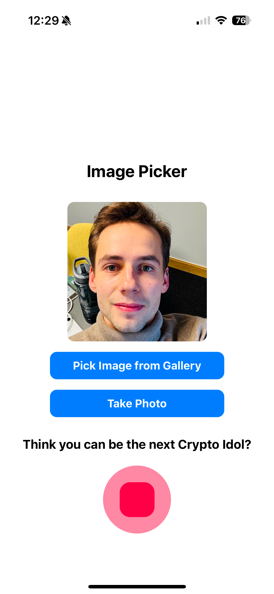

# Prover of Everything

**Prover of Everything** is the central app that hosts our advanced model, integrated prover, and the interface for sending cryptographic proofs. It serves as the heartbeat of our system, enabling users to verify the authenticity of objects and events with ease and security.

---

## What It Does

- **Model Hosting:** Runs a compact machine learning model that processes audio and image inputs for real-time verification.
- **Proof Generation:** Integrates a robust prover that creates cryptographic proofs to ensure the integrity of the verification process.
- **Proof Interaction:** Provides an intuitive user interface for initiating verifications and sending proofs, making the process seamless and user-friendly.

---

## Key Features

- **Unified Experience:** Combines audio and image processing with secure proof generation in a single, cohesive platform.
- **High-Level Security:** Utilizes advanced cryptographic methods, including zero-knowledge proofs, to guarantee that every proof is valid and tamper-proof.
- **Real-Time Feedback:** Offers immediate verification results, ensuring a smooth and responsive user experience.

---

## Technology Stack

- **Frontend:** Built with **React Native** for a smooth and responsive mobile experience.
- **Backend:** Powered by **Node.js** and **Express** to manage proof requests and data interactions.
- **Machine Learning:** Employs an efficient model optimized for on-device audio and image processing.
- **Cryptography:** Leverages cutting-edge cryptographic techniques to generate and verify zero-knowledge proofs.

---

## App Interface

Below is a screenshot of the top-level user interface of the app:

---

## Getting Started

This app is designed to provide a seamless and secure way to verify objects and events. For more detailed documentation on setup and usage, please refer to our main documentation resources.

---

## Conclusion

The **Prover of Everything** app brings together machine learning and cryptographic proof generation into a unified, user-friendly platform. Experience a streamlined verification process that ensures authenticity and integrity at every step.

For a comprehensive overview of the project, check out our [Presentation](https://www.canva.com/design/DAGejCBzjx4/mQu49B6K0e26smrSgZlrxg/edit?utm_content=DAGejCBzjx4&utm_campaign=designshare&utm_medium=link2&utm_source=sharebutton).

Enjoy using **Prover of Everything** to prove what matters!
